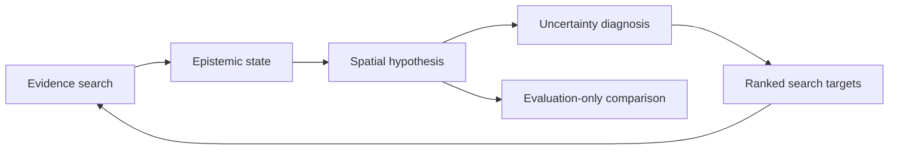

[English](README.md) | [简体中文](README.zh-CN.md)

# Evidence-Driven Historical Geography

**Auditable spatial research agent prototype · Python 3.9+ · backend-neutral research contracts · retrospective and prospective cases**

This project tests whether a research agent can build an acceptable historical-geography hypothesis from scattered, heterogeneous, and conflicting evidence without reading an existing territorial map. The system keeps the agent's epistemic state explicit, compiles eligible decisions into a backend-neutral spatial request, diagnoses where the resulting hypothesis is sensitive, and turns consequential evidence gaps into the next search agenda.




## What the agent does

For each case, the agent works through a research loop:

```text
search and retrieve sources
  -> record observations with locators and rights
  -> reconcile or preserve conflicts
  -> classify claims by spatial meaning
  -> make reviewed model decisions
  -> compile a backend-neutral spatial hypothesis
  -> compare controlled evidence and model scenarios
  -> diagnose consequential uncertainty
  -> rank the next evidence searches
```

This repository supplies the contracts, executable checks, case structure, and failure rules for that loop. Source retrieval can be performed by any capable research agent. Irreducible historical decisions remain visible for human acceptance.

## Why the separation matters

A source may establish that a city changed hands, a ruler used a political title, or an army followed a route. Those observations do not establish a continuous territorial boundary. The lineage keeps sources, observations, claims, model decisions, solver inputs, and output features separate so an agent cannot silently promote one kind of evidence into another.

The v0.2 contract treats `Source → Observation → Claim → Model Decision → Evidence Gap` as the agent's epistemic state. The compiler exposes only generic roles such as control points, spatial constraints, and traversal constraints. XTENT is one replaceable backend behind that boundary.

## Flagship case: Crusader States

The case covers **1130** and **end of 1187**. Round 01 closes the Cairo, Jaffa, Edessa-date, and Tripoli-inland gaps through page-addressable text and gazetteer evidence; it admits Cairo and Jaffa as locality points and adds Rafaniyya as a minor 1130 control point. These changes remain locality constraints, never direct county or state perimeters. Ascalon is now the only open gap promoted to the next targeted search; Tortosa and Latin-survival extent remain recorded without a measured evidence-scenario effect.

The frozen claim-decision register and the round-specific state-change record keep these judgments machine-readable. They record the source/observation/claim/decision delta instead of leaving a revised baseline in prose alone.


## External comparison

The project registers four published maps from three works. Public-domain Shepherd and Johnston plates support a categorical comparison; Buck’s exact 1130 map is recorded as access- and rights-blocked because the legal preview does not expose the map body. No scan or traced atlas boundary is committed.

The frozen Round-00 comparison checks named city control, entity presence, adjacency, and coastal place order. It reports 12 of 17 comparable assertions aligned for the c.1140 proxy, 4 of 4 entity assertions aligned for Shepherd’s c.1190 plate, and 13 of 14 city/entity assertions aligned for Johnston’s 1187–1190 campaign map. These counts describe pre-search agreement, not historical accuracy; the project does not claim an updated Round-01 score.


## Uncertainty-driven research

The frozen Round-00 grouped analysis covers eight evidence, natural-cost, projection, and grid scenarios. Its common analysis grid separates stable core, model-sensitive, evidence-sensitive, and unresolved zones. The current Round-01 diagnosis instead uses atomic evidence counterfactuals and three declared model variants so each remaining search target has an identifiable spatial effect.


Both records show that bounded projection choices dominate the areal result: Round 01 measures 5,823 model-sensitive cells versus one evidence-sensitive cell in 1130, and 5,269 versus zero in 1187. The v0.2 diagnosis links evidence changes back to open gaps. Round 00 ranks the first concrete searches; Round 01 records which gaps were closed and recomputes the residual agenda.

The Crusader case is a retrospective testbed: external maps never enter reconstruction inputs or parameter tuning, although they were already inspected during development.

## Prospective case: Mercia–Welsh frontier

The completed second case covers the **780-01-01 through 796-07-29** terminal Offan interval in a bounded Rhuddlan–upper Severn corridor. It is a strictly preregistered negative result with the terminal outcome **`completed_no_reconstruction`**. No entity reached two independent, interval-applicable named-locality political-control relations, so the stop rule terminated the case without a reconstruction or polygon.

[The prospective case](cases/mercia_welsh_frontier/public/README.md) preserves the immutable preregistration baseline and an append-only reviewed round containing 23 queries, 17 content or catalog checks, 7 admitted sources, atomic observations, claims, exclusions, final gap states, budget accounting, and a criterion-by-criterion gate decision. Offa's Dyke and Wat's Dyke remain outside allocation; engineering locations and broad or disputed dates do not establish a political boundary.

The workflow successfully enforced evidence isolation, the preregistered search budget, and the stopping rule. The registered comparison maps are permanently sealed: no body, thumbnail, PDF page, screenshot, OCR, vector, or boundary geometry has been inspected or stored, and this case will not open them for evaluation. The negative result demonstrates protocol execution under insufficient evidence; it is neither a project failure nor a measurement of historical accuracy. Automated validation enforces freeze hashes, the round hash chain, budget and transition rules, held-out identifier isolation, and the absence of premature reconstruction artifacts; it cannot prove a person's complete browsing history.

## Prospective case: Sennacherib 701

The third case asks which named localities in the Joppa–Ekron–Lachish–Jerusalem corridor can be supported during Sennacherib's conventionally dated **701 BCE campaign/disposition horizon**. Its limited feasibility audit returned **GO for strict preregistration and evidence collection**. The frozen reconstruction gate then returned **NO-GO**, and the case terminated as **`completed_no_reconstruction`**. The baseline records Judah, Ekron, Ashdod, Gaza and Ashkelon; twelve named locality candidates; six preliminary sources; explicit source lineages; and separate layers for local rule, transfer, conquest, tribute, suzerainty, military presence, destruction and local administration.

[The completed prospective case](cases/sennacherib_701_southern_levant/public/README.md) preserves 16 exact queries, 20 content/record checks, 7 admitted sources, both directed follow-up rounds for all eight gaps, and the failed criterion-by-criterion gate. No two entities each reached two independent named-locality local-control relations. It therefore contains no locality-coordinate layer, modeled entity roster, scenario run, sensitivity output, polygon or territorial surface. The registered comparator remains permanently sealed.

This case also introduces the era-aware BCE time contract: `calendar=historical_bce_year_label`, `era=BCE`, `year_bce=701`, and `temporal_resolution=campaign_horizon`. Astronomical year `-700` is an explicit computational conversion, never a negative ISO date.

## Research rounds and policy experiment

`research/rounds/00-initial/` preserves frozen pre-search bundle/scenario snapshots together with the diagnosis and agenda; `research/rounds/01-evidence-update/` preserves its source checks, state changes, and recomputed slice diagnoses. A reviewed round records the source/observation/claim/decision delta together with the diagnosis and search targets that justified the next action; transient solver runs remain under ignored `build/` directories. Canonical hashes bind the before/after snapshots to the round delta.

`research/experiments/equal-budget-policy/` contains a **constructed deterministic replay** of targeted, fixed-order, and broad-order search policies at equal budget. Its declared fixture outcomes appear in the input and result files. The experiment verifies selection and accounting mechanics only; it does not demonstrate that one policy improves real historical research.

## Implemented components

| Component | Role |
|---|---|
| Auditable epistemic state | Keeps source, observation, claim, decision, and evidence gap distinct. |
| Backend-neutral compiler | Selects reviewed decisions and creates a generic reconstruction request. |
| XTENT backend | Translates generic roles into deterministic XTENT solver inputs. |
| Cost-distance reconstruction | Produces valid, non-overlapping territorial surfaces on a projected grid. |
| Uncertainty diagnosis | Separates evidence effects from model sensitivity at grid-cell level. |
| Search-target generator | Ranks only open gaps with observed spatial consequences. |
| Comparative evaluation | Compares external maps without treating them as ground truth or tuning targets. |

## Quick start

```bash
python3 -m venv .venv
.venv/bin/pip install -e '.[test]'

.venv/bin/historical-geo validate cases/crusader_states/public
.venv/bin/historical-geo validate cases/mercia_welsh_frontier/public
.venv/bin/historical-geo validate cases/sennacherib_701_southern_levant/public
.venv/bin/historical-geo compile-request cases/crusader_states/public \
  --slice 1130 --scenario reviewed-baseline
MPLCONFIGDIR=.cache/matplotlib .venv/bin/historical-geo run \
  cases/crusader_states/public --slice 1130
MPLCONFIGDIR=.cache/matplotlib .venv/bin/historical-geo research-loop \
  cases/crusader_states/public --slice 1130
.venv/bin/historical-geo policy-experiment \
  cases/crusader_states/public/research/experiments/equal-budget-policy/experiment.json
MPLCONFIGDIR=.cache/matplotlib .venv/bin/historical-geo figures \
  cases/crusader_states/public
.venv/bin/pytest
```

`validate`, `compile-request`, `reconstruct`, and `run` use the v0.2 epistemic-state compiler followed by the XTENT backend. The hash-frozen v0.1 adapter survives only through `legacy-*` commands for regression fixtures. Generated runs remain under ignored `build/` directories. Reviewed figures and machine-readable metrics are kept under `cases/crusader_states/public/figures/`.

## Verified state

- CI runs the full test suite on supported Python versions.
- The legacy v0.1 baseline is hash-frozen before migration.
- The v0.2 bundle, diagnosis, and search-target documents pass structural and referential validation.
- Backend-boundary tests show that the frozen round-00 v0.2 snapshots reproduce the reviewed v0.1 XTENT baseline; round 01 then records and hashes its intentional input and surface changes.
- Public lineage validation reports zero errors.
- The prospective Mercia–Welsh case terminates as `completed_no_reconstruction`; its metadata-only seal, nine frozen hashes, reviewed round hash chain, budget, lifecycle, no-map-body, and no-polygon checks pass.
- The prospective Sennacherib 701 case terminates as `completed_no_reconstruction`; its BCE conversion, feasibility freeze, append-only research round, budget, round hashes, metadata-only seal, held-out leakage guard, no-map-body, and no-polygon checks pass.
- Required scenarios for both slices rebuild successfully.
- Every run retains its expected scenario entities; geometry is valid and non-overlapping.
- Six figures pass nonblank QA.
- Fixture byte counts and SHA-256 hashes match.
- Paired English/Chinese headings and relative links pass repository checks.
- No cache, absolute machine path, source PDF, atlas scan, restricted map derivative, or unexpected large file is present in the public tree.

These checks establish reproducibility and auditability. Historical acceptance still requires a qualified reader.

## Documentation

- [Methodology and agent research protocol](docs/architecture/methodology.md)
- [Crusader States case study](docs/research/crusader-states-case-study.md)
- [Historical source review](docs/research/source-review.md)
- [Comparative evaluation](docs/research/comparative-evaluation.md)
- [Uncertainty analysis](docs/research/uncertainty-analysis.md)
- [Reproducibility guide](docs/operations/reproducibility.md)
- [Fixture attribution and rights](cases/crusader_states/public/ATTRIBUTION.md)
- [Software license](LICENSE) and [data/content terms](DATA-LICENSE.md)
