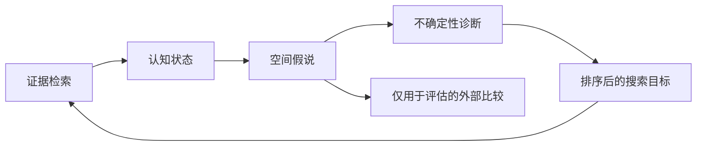

[English](README.md) | [简体中文](README.zh-CN.md)

# 证据驱动的历史地理重建

**可审计空间研究 Agent 原型 · Python 3.9+ · 后端中立研究契约 · 回顾性与 prospective 案例**

这个项目检验研究型 Agent 能否在不读取现成历史疆域地图的条件下，从分散、异质且相互冲突的证据中构造可接受的历史地理假说。系统显式保存 Agent 的认知状态，把合格决策编译为后端中立的空间请求，诊断假说在哪些区域敏感，再把真正影响空间结果的证据缺口转成下一轮搜索议程。




## Agent 负责什么

每个案例都经过同一条研究链：

```text
检索并取得来源
  -> 记录带定位与权利状态的观察
  -> 处理冲突，或明确保留冲突
  -> 按空间含义分类主张
  -> 作出经审查的模型决策
  -> 编译后端中立的空间假说
  -> 比较受控的证据情景与模型情景
  -> 诊断有后果的不确定性
  -> 排定下一轮证据搜索
```

仓库提供闭环所需的契约、可执行检查、案例结构和失败规则。资料检索可以由任何具备相应能力的研究 Agent 完成；无法化约的历史判断继续留给人工接受。

## 为什么必须分层

史料可能证明某城市易手、某统治者使用政治头衔，或某支军队沿路线行动。这些观察都不能直接证明连续领土边界。谱系把来源、观察、主张、模型决策、求解器输入和输出要素分开，防止 Agent 静默提升证据的空间含义。

v0.2 契约把 `Source → Observation → Claim → Model Decision → Evidence Gap` 定义为 Agent 的认知状态。编译器只暴露控制点、空间约束、通行约束等通用角色；XTENT 位于这条边界之后，是可以替换的空间推断后端。

## 核心案例：十字军诸国

案例覆盖 **1130 年**和 **1187 年末**。第 01 轮通过可按页定位的文本与地名库证据关闭 Cairo、Jaffa、Edessa 年份与 Tripoli 内陆四项缺口；Cairo 和 Jaffa 被纳入地点约束，Rafaniyya 作为 1130 年次要控制点加入。它们都只构成地点约束，不能直接推出伯国或政权的连续边界。Ascalon 现为唯一被提升到下一轮定向检索的开放缺口；Tortosa 与 Latin survival extent 仍被保留，但尚无已测得的证据情景影响。

冻结的主张决策登记表与按轮次保存的状态变化记录共同使这些判断机器可读。它们保存 source、observation、claim、decision 的增量，避免只在文字中替换基线。


## 外部比较

项目登记了三套出版物中的四幅地图。公有领域的 Shepherd 与 Johnston 地图用于分类比较；Buck 的精确 1130 地图因合法预览未开放正文，被记录为访问和权利受阻。仓库没有提交扫描页或沿地图集描绘的边界。

冻结的 Round-00 比较维度包括具名城市控制、实体存在、邻接与海岸地点顺序。约 1140 年代理图有 17 项可比断言，其中 12 项一致；Shepherd 约 1190 年图的 4 项实体断言全部一致；Johnston 1187—1190 战役图有 14 项城市与实体断言，其中 13 项一致。这些数值表示检索前的一致程度，不是历史准确率；项目没有声称得到 Round-01 的新评分。


## 不确定性驱动研究

冻结的 Round-00 成组分析覆盖 8 个证据、自然成本、projection 和格网情景，统一分析格网把结果分为 stable core、model-sensitive、evidence-sensitive 与 unresolved zone。当前 Round-01 诊断改用单项证据反事实和三个已声明模型变体，使每个剩余搜索目标都具有可识别的空间效应。


两份记录都显示有界 projection 选择主导当前面状结果：Round 01 在 1130 年测得 5,823 个模型敏感格网与 1 个证据敏感格网，1187 年分别为 5,269 和 0。v0.2 诊断把证据变化追溯到开放缺口。Round 00 生成首批具体搜索任务；Round 01 保存已关闭缺口并重新计算剩余议程。

十字军案例属于回顾性 testbed：外部地图从未进入重建输入或参数调优，但开发期间已经被检查。

## Prospective 案例：Mercia–Welsh 边疆

第二案例覆盖 Rhuddlan—upper Severn 有界走廊内 **780-01-01 至 796-07-29** 的 terminal Offan interval。冻结后的非地图证据轮次已经完成，登记终态为 **`completed_no_reconstruction`**。没有任何实体取得两条相互独立且适用于目标区间的具名地点控制关系，因此案例在不生成 polygon 的条件下终止。

[Prospective 案例](cases/mercia_welsh_frontier/public/README.zh-CN.md)保留不可变预注册基线与 append-only 审核轮次，其中包含 23 次查询、17 次内容或馆藏记录检查、7 项采纳来源、原子 observation、claim、排除 decision、最终 gap 状态、预算账本和逐项 gate 裁决。Offa's Dyke 与 Wat's Dyke 继续排除出 allocation；工程位置及宽泛或有争议的年代都不能证明政治边界。

登记的比较地图继续封存：没有查看或保存任何主体、缩略图、PDF 页面、截图、OCR、矢量或边界几何。失败的重建 gate 使案例在评估前终止。自动验证会强制核验冻结哈希、轮次哈希链、预算与阶段迁移、held-out 标识符隔离以及无提前重建产物；它不能证明个人完整浏览历史。

## 研究轮次与搜索策略实验

`research/rounds/00-initial/` 保存冻结的检索前 bundle、情景快照、诊断与议程；`research/rounds/01-evidence-update/` 保存其来源核查、状态变化和重新计算的切片诊断。经过审查的每一轮都会记录 source、observation、claim、decision 的增量，以及支撑下一步行动的诊断和搜索目标；临时求解结果仍位于已忽略的 `build/` 目录。规范化哈希把前后快照与轮次增量绑定在一起。

`research/experiments/equal-budget-policy/` 保存 targeted、fixed-order 与 broad-order 三种搜索策略的等预算**构造性确定性回放**。声明的 fixture 结果均在输入和结果文件中明示。该实验只核验选择与计量机制，不能证明任一策略会提升真实历史研究。

## 已实现组件

| 组件 | 作用 |
|---|---|
| 可审计认知状态 | 分离来源、观察、主张、决策和证据缺口。 |
| 后端中立编译器 | 选择经审查的决策并生成通用重建请求。 |
| XTENT 后端 | 把通用空间角色翻译为确定性的 XTENT 输入。 |
| 成本距离重建 | 在投影格网上生成有效、无重叠的领土表面。 |
| 不确定性诊断 | 在格网单元层面区分证据效应与模型敏感性。 |
| 搜索目标生成器 | 只对已观察到空间后果的开放缺口排序。 |
| 外部比较 | 在不把参考图当成 ground truth 或调参目标的前提下做分类比较。 |

## 快速运行

```bash
python3 -m venv .venv
.venv/bin/pip install -e '.[test]'

.venv/bin/historical-geo validate cases/crusader_states/public
.venv/bin/historical-geo validate cases/mercia_welsh_frontier/public
.venv/bin/historical-geo compile-request cases/crusader_states/public \
  --slice 1130 --scenario reviewed-baseline
MPLCONFIGDIR=.cache/matplotlib .venv/bin/historical-geo run \
  cases/crusader_states/public --slice 1130
MPLCONFIGDIR=.cache/matplotlib .venv/bin/historical-geo research-loop \
  cases/crusader_states/public --slice 1130
.venv/bin/historical-geo policy-experiment \
  cases/crusader_states/public/research/experiments/equal-budget-policy/experiment.json
MPLCONFIGDIR=.cache/matplotlib .venv/bin/historical-geo figures \
  cases/crusader_states/public
.venv/bin/pytest
```

`validate`、`compile-request`、`reconstruct` 与 `run` 会经过 v0.2 认知状态编译器，再进入 XTENT 后端。哈希冻结的 v0.1 adapter 只通过 `legacy-*` 命令服务回归 fixture。运行中间结果保存在已忽略的 `build/` 目录。审查后的图件与机器可读指标位于 `cases/crusader_states/public/figures/`。

## 已核验状态

- CI 会在受支持的 Python 版本上运行完整测试集。
- v0.1 旧基线在迁移前已经完成哈希冻结。
- v0.2 bundle、诊断与搜索目标文档通过结构和引用校验。
- 后端边界测试证明，冻结的第 00 轮 v0.2 快照复现了已审查的 v0.1 XTENT 基线；第 01 轮则明确记录并哈希其有意引入的输入与表面变化。
- 公开谱系验证为零错误。
- Prospective Mercia–Welsh 案例以 `completed_no_reconstruction` 终止；metadata-only 封存、九项冻结哈希、审核轮次哈希链、预算、生命周期、无地图主体与无 polygon 检查全部通过。
- 两个切片的必要情景均可重建。
- 每个运行都保留该情景预期实体，几何有效且无重叠。
- 6 张图全部通过非空 QA。
- Fixture 字节数与 SHA-256 一致。
- 中英文配对标题结构和 Markdown 相对链接通过检查。
- 公开树中没有缓存、绝对机器路径、来源 PDF、地图集扫描、受限地图衍生物或意外大文件。

这些核验说明流程可复现、可审计；历史学接受仍需合格读者作出判断。

## 文档

- [方法论与 Agent 研究协议](docs/architecture/methodology.zh-CN.md)
- [十字军诸国案例研究](docs/research/crusader-states-case-study.zh-CN.md)
- [历史来源审查](docs/research/source-review.zh-CN.md)
- [外部地图比较](docs/research/comparative-evaluation.zh-CN.md)
- [不确定性分析](docs/research/uncertainty-analysis.zh-CN.md)
- [复现指南](docs/operations/reproducibility.zh-CN.md)
- [案例数据归属与权利说明（英文）](cases/crusader_states/public/ATTRIBUTION.md)
- [软件许可证（英文）](LICENSE)与[数据及内容条款（英文）](DATA-LICENSE.md)
